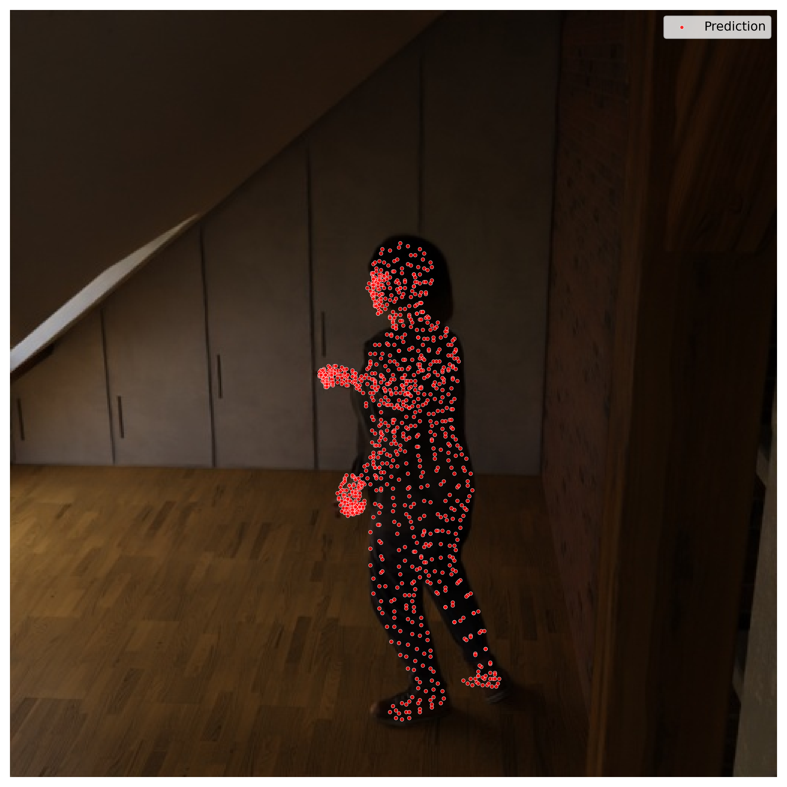
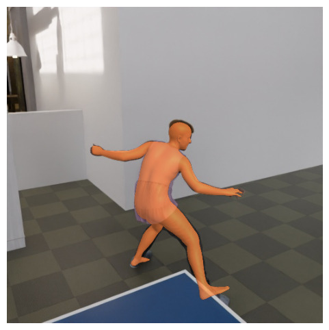
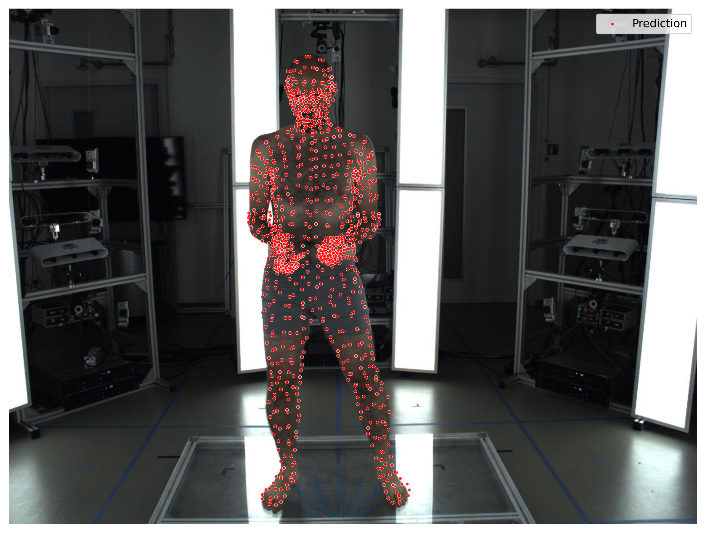
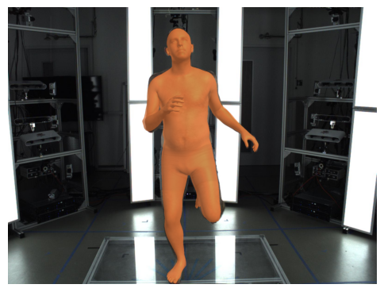

# Look Ma No Markers - Implementation for 3D Body and Hand Pose Estimation

This repository implements hand and body pose estimation based on the paper [Look Ma, no markers](https://microsoft.github.io/SynthMoCap/), using synthetic [data](https://github.com/microsoft/SynthMoCap) provided by the authors.

<p float="left">
 
 
  
 
</p>

We use the extended SMPL+H body model from [MANO](https://mano.is.tue.mpg.de/) as a substitute for the SOMA model used in the paper, which is not publicly available.

## Installation
After cloning this repository and navigating to its root folder, create a virtual environment and install the required dependencies:
```
conda create --name dslab python=3.10
conda activate dslab
pip install -r requirements.txt
```
Then install the required developer packages manually:

#### [SMPL-X](https://github.com/vchoutas/smplx)
```
git clone https://github.com/vchoutas/smplx
cd smplx
python setup.py install
```
#### [AITViewer](https://github.com/eth-ait/aitviewer)
```
git clone https://github.com/eth-ait/aitviewer.git
cd aitviewer
pip install -e .
```
#### [VPoser](https://github.com/nghorbani/human_body_prior)
```
https://github.com/nghorbani/human_body_prior.git
cd human_body_prior
python setup.py install
```

Finally, add the `src` directory to your Python path.

> **Note**: If you encounter an `'_ctx'` attribute error, try installing:
> ```bash
> pip install moderngl-window==2.4.6 pyglet
> ```

### Important edits
To enable support for the neutral SMPL+H model in AITViewer, modify the following files:

* In `aitviewer/models/smpl.py` uncomment lines 39–40
* In `aitviewer\renderables\smpl.py` uncomment lines 160-166

## Parametric Human Body Model
Download the MANO and extended SMPL+H models from the [MANO website](https://mano.is.tue.mpg.de/download.php). 

Follow the instructions [here](https://github.com/vchoutas/smplx/blob/main/tools/README.md) to merge the neutral SMPL+H model (used in AMASS) with the MANO hand parameters.

Create the following directory `src/models/smplx/params/smplh/` and place the created `SMPLH_NEUTRAL.pkl` file inside.

## Datasets
The `tools` directory contains helper scripts provided by the original paper authors. See [DATASETS.md](tools/DATASETS.md) for detailed instructions.

### SynthBody and SynthHand

Download the **SynthBody** and **SynthHand** datasets into `data` using the script in `tools/download`.

To generate 2D landmarks used for training the body and hand networks, run:
```bash
python tools/preprocess/generate_ldmks.py
```
Repeat with the `--hand` flag to generate hand landmarks.
```bash
python tools/preprocess/generate_ldmks.py --hand
```
> **Note**: Generating dense landmarks may take several hours to complete.

### Evaluation dataset: EHF
We use the **EHF dataset** for evaluation, which can be downloaded from the [SMPL-X webpage](https://smpl-x.is.tue.mpg.de/download.php). Place the downloaded files into `data/EHF/`.

To convert the provided SMPL-X objects to parameters for our neutral SMPL-H model, follow the instructions from the [SMPL-X model transfer guide](https://github.com/vchoutas/smplx/tree/main/transfer_model). After conversion place the created `.pkl` files under `data/EHF/smplh`.

## Data Visualization

### 2D Visualization

The `tools/visualize` directory contains the original 2D visualization script from the paper authors.
This can be used to inspect dataset annotations in image space.  

### 3D Visualization

To interactively explore the synthetic datasets in 3D, use our custom script based on the AITViewer:

```bash
python src/visualization/visualize_aitv.py
```
This script visualizes our generated dense 3D landmarks, which are projected to image space for training the networks on dense 2D landmarks.

Optional flags include

* `--joints`    Visualize the original 2D/3D annotations from the dataset
* `--hand`      Visualize samples from the SynthHand dataset
* `--sidx`      Specify a subject (body identity) index
* `--fidx`      Specify a frame index

## Training
For training, a subset of the earlier-installed dependencies is sufficient. We recommend using the dependencies listed in `requirements_euler.txt`.

Navigate to the `src` directory and configure training parameters in:
* `training/body.yaml` (for training the body network)
* `training/hand.yaml` (for training the hand network)

Parameters documented in the paper are marked with comments; other may require further tuning.

To train the body model:
```
python training/train.py
```
To train the hand model:
```
python training/train.py --hand
```
## Inference
Running the full method requires training checkpoints for both the body and the hand network.

Place the model checkpoints and corresponding config files in `src/models/checkpoints/`. Then, update the `run_name` variable in the `load_model` function within `src/models/load.py` to match the name of the config and model files.

Additionally, VPoser v2.0 parameters are required for the optimization step. Download them from the [SMPL-X download page](https://smpl-x.is.tue.mpg.de/download.php) and place them in `src/inference/vposer/V02_05`.

### Running the Full Architecture
To run the full pipeline on a batch of images, refer to the example in `experiments/demo.py`.  
This script performs inference using the trained body and hand networks, followed by optimization-based refinement of the predicted SMPL-H parameters and visualizes the final results using the AITViewer.

### Visualizing Landmark Predictions
To visualize dense 2D landmark predictions and initial pose and shape estimates from the trained networks, use:
```
python experiments/visualize_ldmks.py --dataset synth --part full
```
Available `--dataset` options:
* `synth`   Use synthetic validation set samples
* `ehf`     Use the EHF evaluation set

Available `--part` options (only for synthetic dataset):
* `body`    Visualize predictions from the body model only
* `hand`    Visualize predictions from the hand model only
* `full`    Combine predictions from both body and hand models

The script will:
* Save landmark predictions under the `experiments/` directory
* Display two random examples from the batch using the AITViewer, each displaying two frames:
    * Frame 1: Ground-truth mesh
    * Frame 2: Predicted mesh
> **Note**: The displayed predictions include ground-truth parameters for parts not estimated by the selected model (e. g., hand pose for body-only predictions). 

## Evaluation

### Visualizing the EHF Dataset
To inspect samples from the EHF dataset in the AITViewer, run:
```
python src/evaluation/visualize_ehf.py
```

### Quantitative Evaluation
To evaluate the performance of the method on the EHF or synthetic validation set, run:
```
python src/evaluation/test_ehf.py --dataset ehf
```
This computes the following metrics:
* MPVPE: Mean Per-Vertex Position Error (pelvis-aligned)
* PA-MPVPE: Procrustes-Aligned MPVPE
* PA-MPJPE: Procrustes-Aligned Mean Per-Joint Position Error

Available `--dataset` options:
* `synth`   Evaluate on synthetic validation set 
* `ehf`     Evaluate on the EHF dataset

Optional flags are:
* `--optimize`       Include optimization-based refinement
* `--visualize`      Visualize predictions for randomly selected samples from each batch

## Acknowledgments
We thank the authors of [Look Ma, no markers](https://microsoft.github.io/SynthMoCap/) for providing synthetic datasets and code that supports this implementation.